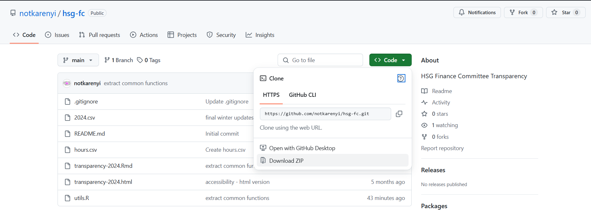

# Harris Student Government Finance Committee Transparency Report

Creates data visualizations for financial transparency in a student government with an annual budget of over $60,000.

Combines data from current quarter applications with previous quarter applications to give a picture of planned and actual expenses.

## Prerequisites

To use this repository, you should know how to run an R script. It helps if you have an understanding of how to write R, RMarkdown, and/or Markdown files.

If you know how to use GitHub, you can contribute to the code of this project and improve it over time. If you don't know how to use GitHub, you don't need it.

## Generating the rubrics

TBD

## Running the transparency report

Each quarter, the Finance Committee should create a new report by completing the following steps:

### Get the data

1. Download all current quarter finance applications as a ZIP file and unzip it on your computer.
2. Put it in a folder called `/Quarter Year` in this repository, (see below for how to download the repository). For example: `/Spring 2024`.
3. You may need to edit lines in the Excel applications as needed to overcome bugs in how people filled it out compared to how the computer is expecting the data to look, but hopefully this will be minimal.

### Get the code

1. Download this repository as a ZIP file and unzip it on your computer.

   

2. Make a new copy of `data/template.csv` and `template.Rmd` and rename with the current quarter, following the example of previous years.

3. Update the quarter in line 1 of `knit.R`: 
   ```r
   quarter <- "Fall 2024"
   ```

4. Update text in`CURRENT_QUARTER.Rmd`, as needed, to explain the findings. Also update commitee members at the end of the document: 
   ```r
   FIRST LAST, Finance Committee Member
   ```

5. Run `run.R` in RStudio. You should get an HTML output.
